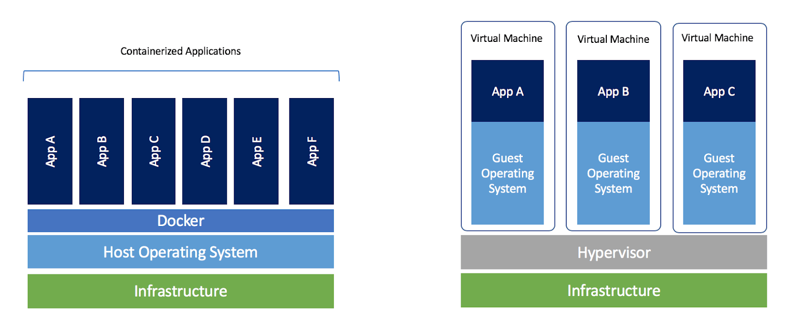

# Docker

Docker hat direkt nichts mit Datenbanken zu tun. Jedoch sieht die Realität so aus dass Sie, wenn Sie eine Datenbank brauchen kaum noch [diese direkt installieren werden](https://www.mysql.com/downloads/). [In einem Docker-Container](https://hub.docker.com/_/mysql) gibt es eine Version der gleichen Datenbank mit vielen Vorteilen gegenüber einer direkten Installation. 

Docker ist ein vielseitig einsetzbares Werkzeug um *Umgebungen* und *Services* **automatisiert** zu konfigurieren. Im Unterschied zu virtuellen Maschinen - womit man ebenfalls eine einheitliche Umgebung erzeugen kann - werdem bei Docker jedoch nur Teile des Betriebssystems simuliert. Dies führt dazu das der Ressorcenverbrauch geringer ist.



*Abb 1: Schematische Darstellung der Architekturunterschiede von Docker zu VMs*

### Dockerfile
Möchte man ein Projekt in einem Docker-Container bereitstellen muss im Root-Verzeichnis die Datei `Dockerfile` vorhanden sein. Diese könnte für ein nodejs-Project z.B so aussehen:

```Dockerfile
# basisimage ist node in der Version 16
FROM node:16 

# Verzeichnis mit Projektdaten
WORKDIR /usr/src/app 

# Daten über dependencies in den container importieren
COPY package*.json ./ 

# installationsprozess starten
RUN npm install

# restliche daten importieren
COPY . .

# Port 80 (HTTP) freigeben
EXPOSE 80

# server starten
CMD [ "node", "server.js" ]
```
In dem Dockerfile werden die Umgebung sowie die nötigen Installationsschritte spezifiziert. Dadurch kann man mit `docker build` und anschliesendem `docker run` sein eigenes Image erzeugen und ausführen. 

Bei jedem einzelenen Schritt wird ein Zwischencontainer angelegt. Diese werden gecacht und nur wenn sich im entsprechenden Schritt etwas geändert hat wird dieser und die Folgenden neu ausgeführt. Im oberen Beispiel wurde diese Eigenschaft dazu genutzt das langwierige `npm install` darauf zu beschränken wenn sich etwas in den package.json Konfigurationen ändert. 

### Docker Compose

Dockerfiles beschreiben immer einen einzelenen Service (z.B eine node webapp). Jedoch gibt es in der Praxis nahezu immer mehrere Services welche zusammen ein Gesamtsystem ergeben. So benötigt eine Webapp häufig eine Datenbank. Einen weiteren Webservice für eine API ist nicht unüblich. Legacy Systeme benötigen oft eine andere Oberfläche als die moderenern Systeme, auch sie benötigen eigene Container. Jeder Container existiert dann für sich abgeschlossen und nur über vordefinierte Ports bzw. Ordner kann auf diese Zugegriffen werden. 

All diese Container immer neu zu erstellen (und entsprechende Volumes, virtuelle Netzwerke etc.) zu verwalten kann schnell aufwändig werden. Docker-Compose nimmt einem hier vieles ab. Man kann mehrere Container sowie deren Zusammenspiel direkt in einer Datei konfigurieren. Mit `docker-compose up` werden dann automatisch die Container gebuilded und ausgeführt. Die Konfigurationsdatei `docker-compose.yml` kann z.B so aussehen:

```yaml
version: "3"
services:
  
  ui:
   build:
      context: ./ui
   ports:
    -  4200:4200
   container_name: mean-ui
   networks:
    -  mean-stack-net
   volumes:
    -  ./ui/src:/usr/app/src
    -  ./ui/public:/usr/app/public
   depends_on:
    - api
   stdin_open: true
   tty: true

  api:
   build:
      context: ./api
   ports:
     - 3080:3080
   container_name: mean-api
   networks:
     - mean-stack-net
   volumes:
    - ./api/src:/usr/app/src
   depends_on:
    - db

  db:
    image: mongo
    ports:
      - 27017:27017
    container_name: mongo-db
    networks:
      - mean-stack-net
    volumes:
      - mongo-data:/data/db

networks:
  mean-stack-net:

volumes:
  mongo-data:

```

